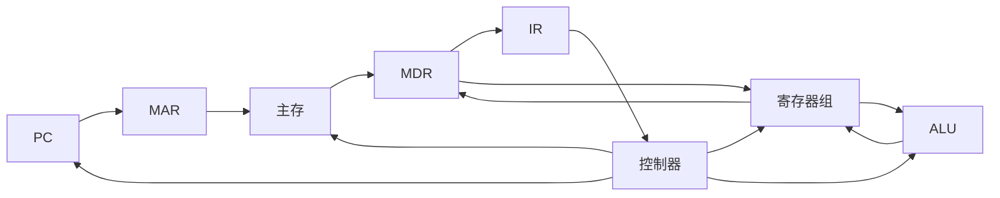

# 计算机组成原理期末复习笔记 V1

> 适用场景：按照你给出的老师透露考点，结合常见《计算机组成原理》课程体系整理。  
> 使用建议：先按视频/课件复习一章，再看本章的“高频考点 → 公式 → 例题 → 易错点”。  
> 说明：第一版不等同于老师课件原文，后续最好用你们课后题、PPT圈画内容继续补充。

---

## 目录

- [0. 复习总览与考试权重判断](#0-复习总览与考试权重判断)
- [1. 计算机系统概述](#1-计算机系统概述)
- [2. 数据信息的表示](#2-数据信息的表示)
- [3. 运算方法与运算器](#3-运算方法与运算器)
- [4. 存储系统与 Cache](#4-存储系统与-cache)
- [5. 指令系统](#5-指令系统)
- [6. 中央处理器 CPU](#6-中央处理器-cpu)
- [7. 指令流水线](#7-指令流水线)
- [8. 总线系统](#8-总线系统)
- [9. 输入输出系统](#9-输入输出系统)
- [10. 期末速记公式与易错点](#10-期末速记公式与易错点)

---

# 0. 复习总览与考试权重判断

## 0.1 按你提供的信息判断的优先级

| 优先级 | 章节 | 复习重点 |
|---|---|---|
| S | 第 6 章 CPU | 数据通路、指令操作流程、控制器、微操作、取指/执行/中断流程 |
| S | 第 4 章 Cache | Cache 地址划分、映射方式、命中率、平均访问时间、替换与写策略、主存组织与 CPU 连接 |
| A | 第 3 章 运算器 | IEEE 浮点数转换、定点加减、定点乘除、溢出判断 |
| A | 第 2 章 数据表示 | 原码/反码/补码/移码、补码范围、校验码、海明码、CRC |
| A | 第 1 章 概述 | CPI、CPU 执行时间、性能指标、冯诺依曼思想 |
| B | 第 5 章 指令系统 | 指令格式、地址码、寻址方式、RISC/CISC |
| B | 第 8 章 总线 | 总线概念、带宽计算、仲裁、同步/异步通信 |
| C | 第 7 章 流水线 | 概念题：吞吐率、加速比、相关/冲突 |
| C | 第 9 章 I/O | 小题：程序查询、中断、DMA、通道、接口寄存器 |

## 0.2 计算题常见套路

1. **性能题**：先写公式，再代数值。重点是 $T=IC \times CPI \times T_c=\dfrac{IC\times CPI}{f}$。
2. **补码题**：先定字长，再判断范围，再转补码，最后看是否溢出。
3. **浮点题**：十进制 → 二进制 → 规格化 → 符号位/阶码/尾数 → 拼接。
4. **Cache 题**：先算块内偏移位，再算 Cache 行/组数，再算索引位，剩下是标记位。
5. **CPU 流程题**：按“取指 → 译码 → 执行 → 写回/更新 PC → 中断检查”写微操作。
6. **总线题**：统一单位，注意 bit 与 Byte 的换算：$1B=8bit$。

---

# 1. 计算机系统概述

## 1.1 本章高频考点

- 冯·诺依曼计算机的核心思想。
- 计算机硬件五大组成部分。
- 指令和数据在存储器中的关系。
- CPI、时钟周期、主频、CPU 执行时间。
- 响应时间、吞吐率、带宽、延迟、MIPS、FLOPS 等性能指标。
- 程序性能比较与加速比计算。

---

## 1.2 冯·诺依曼结构

冯·诺依曼结构的核心是：

> **存储程序思想**：程序和数据都用二进制形式存放在存储器中，CPU 按地址顺序或按转移指令控制的顺序取出指令并执行。

### 五大组成部分

| 组成部分 | 作用 |
|---|---|
| 运算器 | 执行算术运算和逻辑运算 |
| 控制器 | 取指、译码、产生控制信号 |
| 存储器 | 存放程序和数据 |
| 输入设备 | 把外部信息送入计算机 |
| 输出设备 | 把处理结果送出计算机 |

现代计算机中，**运算器 + 控制器**通常合称为 **CPU**。

### 冯·诺依曼结构体现了什么？

考试常见表述：

1. **程序存储**：程序和数据一样存放在主存中。
2. **二进制表示**：指令和数据均采用二进制编码。
3. **顺序执行为主**：CPU 通常按 PC 指示顺序取指，遇到转移指令才改变执行顺序。
4. **以运算器为中心的早期结构 / 以存储器为中心的现代结构**：现代系统中 CPU、I/O 都围绕存储器交换信息。
5. **指令由操作码和地址码组成**：操作码指出做什么，地址码指出操作数在哪里。

---

## 1.3 计算机性能指标

## 1.3.1 与时间相关的指标

| 指标 | 含义 | 常见公式/说明 |
|---|---|---|
| 时钟周期 $T_c$ | CPU 一个时钟脉冲的时间 | $T_c=1/f$ |
| 主频 $f$ | 每秒时钟周期数 | 单位 Hz、MHz、GHz |
| CPU 时间 | CPU 真正用于执行某程序的时间 | $CPU\ Time=IC\times CPI\times T_c$ |
| 响应时间 | 从提交任务到得到结果的总时间 | 包括 CPU、I/O、等待等 |
| 吞吐率 | 单位时间完成任务数量 | 常用于批处理、流水线、服务器 |
| 延迟 | 一次操作从开始到完成的时间 | 与吞吐率不同 |
| 带宽 | 单位时间传输的数据量 | 常用于存储器、总线、网络 |

### 核心公式

$$
CPU\ Time = 指令条数(IC) \times 平均CPI \times 时钟周期(T_c)
$$

又因为：

$$
T_c=\frac{1}{f}
$$

所以：

$$
CPU\ Time=\frac{IC \times CPI}{f}
$$

---

## 1.3.2 CPI、IPC、MIPS、FLOPS

### CPI

CPI 是 **Cycles Per Instruction**，即平均每条指令需要多少个时钟周期。

如果有多类指令：

$$
CPI_{avg}=\sum_{i=1}^{n}(比例_i \times CPI_i)
$$

### IPC

IPC 是 **Instructions Per Cycle**，即每个时钟周期完成多少条指令。

$$
IPC=\frac{1}{CPI}
$$

这是理想化关系，实际处理器有流水线、乱序、多发射等因素。

### MIPS

MIPS 是每秒百万条指令：

$$
MIPS=\frac{指令条数}{执行时间\times 10^6}=\frac{f}{CPI\times 10^6}
$$

注意：MIPS 不一定能公平比较不同指令系统的机器，因为不同机器“一条指令”能完成的工作量不同。

### FLOPS

FLOPS 表示每秒浮点运算次数，常用于科学计算、AI、图形计算。

---

## 1.4 例题 1：平均 CPI 和 CPU 执行时间

### 题目

某程序共有 $10^9$ 条指令，运行在主频为 2GHz 的 CPU 上。指令类型及比例如下：

| 指令类型 | 比例 | CPI |
|---|---:|---:|
| ALU 指令 | 50% | 1 |
| 访存指令 | 30% | 2 |
| 分支指令 | 20% | 3 |

求平均 CPI 和 CPU 执行时间。

### 解析

平均 CPI：

$$
CPI_{avg}=0.5\times1+0.3\times2+0.2\times3=1.7
$$

主频 2GHz：

$$
f=2\times10^9 Hz
$$

CPU 执行时间：

$$
CPU\ Time=\frac{IC\times CPI}{f}
=\frac{10^9\times1.7}{2\times10^9}=0.85s
$$

### 答案

- 平均 CPI = 1.7
- CPU 执行时间 = 0.85s

---

## 1.5 例题 2：两台机器性能比较

### 题目

两台计算机运行同一程序，指令条数相同。

| 机器 | 主频 | CPI |
|---|---:|---:|
| A | 3GHz | 2.0 |
| B | 2GHz | 1.2 |

哪台机器更快？快多少？

### 解析

执行时间正比于：

$$
\frac{CPI}{f}
$$

A：

$$
T_A \propto \frac{2.0}{3}=0.6667
$$

B：

$$
T_B \propto \frac{1.2}{2}=0.6
$$

B 的执行时间更短。

加速比：

$$
Speedup=\frac{T_A}{T_B}=\frac{0.6667}{0.6}\approx1.11
$$

### 答案

B 更快，约为 A 的 1.11 倍。

### 易错点

不能只看主频。主频高但 CPI 也高时，可能并不快。

---

## 1.6 例题 3：Amdahl 定律

### 题目

某程序中 80% 的部分可以被优化，优化后这部分速度提高 4 倍。求整个程序的加速比。

### 解析

Amdahl 定律：

$$
Speedup=\frac{1}{(1-P)+\frac{P}{S}}
$$

其中：

- $P=0.8$
- $S=4$

$$
Speedup=\frac{1}{0.2+\frac{0.8}{4}}=\frac{1}{0.2+0.2}=2.5
$$

### 答案

整体加速比为 2.5。

---

## 1.7 本章易错点

1. **主频高不一定性能强**，还要看 CPI 和指令条数。
2. **CPU 时间不等于响应时间**。响应时间可能包含 I/O、系统等待、调度开销等。
3. **MIPS 不适合跨体系结构比较**。
4. **CPI 是平均值**，不是所有指令都一样。
5. **冯·诺依曼思想的关键词是“存储程序”**，不要只答“五大部件”。

---

# 2. 数据信息的表示

## 2.1 本章高频考点

- 进制转换。
- 无符号数和有符号数。
- 原码、反码、补码、移码。
- 补码表示范围和符号扩展。
- 溢出判断。
- 定点小数、定点整数。
- 数据校验：奇偶校验、海明码、CRC。

---

## 2.2 常见单位

| 单位 | 含义 |
|---|---|
| bit | 位，最小信息单位 |
| Byte / B | 字节，1B = 8bit |
| KB | 常按 $2^{10}$ B = 1024B |
| MB | $2^{20}$ B |
| GB | $2^{30}$ B |
| 字 | CPU 一次自然处理的数据单位，和机器字长有关 |
| 字长 | CPU 一次能处理的二进制位数，如 32 位、64 位 |

---

## 2.3 无符号数和有符号数

### 无符号数

n 位无符号数范围：

$$
0 \sim 2^n-1
$$

例如 8 位无符号数范围：

$$
0 \sim 255
$$

### 有符号数

最高位通常作为符号位：

- 0 表示正数
- 1 表示负数

但不同编码方式下，负数的表示不同。

---

## 2.4 原码、反码、补码、移码

设机器字长为 n 位。

| 编码 | 正数 | 负数 | 0 的表示 | 范围 |
|---|---|---|---|---|
| 原码 | 符号位 0 + 数值位 | 符号位 1 + 数值位 | +0 和 -0 两种 | $-(2^{n-1}-1) \sim +(2^{n-1}-1)$ |
| 反码 | 与原码相同 | 符号位不变，数值位取反 | +0 和 -0 两种 | $-(2^{n-1}-1) \sim +(2^{n-1}-1)$ |
| 补码 | 与原码相同 | 反码 + 1 | 只有一个 0 | $-2^{n-1} \sim 2^{n-1}-1$ |
| 移码 | 常用于阶码 | 真值 + 偏置值 | 视偏置而定 | 常用于浮点阶码 |

### 补码为什么重要？

补码的主要优点：

1. 加法和减法可以统一成加法。
2. 0 的表示唯一。
3. 负数比正数多一个最小值，例如 8 位补码最小值是 -128。
4. 符号扩展方便。

---

## 2.5 补码转换方法

### 正数

正数的原码、反码、补码都相同。

例如 8 位表示 $+23$：

$$
23_{10}=00010111_2
$$

所以：

```text
[+23]原 = 00010111
[+23]反 = 00010111
[+23]补 = 00010111
```

### 负数

以 8 位表示 $-23$：

1. 写出 +23 的二进制：`00010111`
2. 按位取反：`11101000`
3. 末位加 1：`11101001`

所以：

```text
[-23]补 = 11101001
```

### 从补码求真值

若最高位为 0，直接转十进制。  
若最高位为 1，说明是负数：

方法一：按位取反加 1，得到绝对值，再加负号。  
方法二：按权展开，最高位权值为 $-2^{n-1}$。

例如：

```text
11101001
```

按权展开：

$$
-128+64+32+8+1=-23
$$

---

## 2.6 补码范围

n 位补码范围：

$$
-2^{n-1} \sim 2^{n-1}-1
$$

| 位数 | 补码范围 |
|---:|---:|
| 8 位 | -128 ~ 127 |
| 16 位 | -32768 ~ 32767 |
| 32 位 | $-2^{31}$ ~ $2^{31}-1$ |

### 易错点

8 位补码没有 +128，但有 -128。

---

## 2.7 符号扩展

补码从短字长扩展到长字长时，直接复制符号位。

例如 8 位补码：

```text
[-23]补 = 11101001
```

扩展为 16 位：

```text
11111111 11101001
```

正数则补 0：

```text
[+23]补 = 00010111
扩展为 16 位 = 00000000 00010111
```

---

## 2.8 溢出判断

补码加法中，溢出只可能发生在：

1. 两个正数相加得到负数。
2. 两个负数相加得到正数。

不同符号数相加不会溢出。

### 方法一：看符号位

若两个操作数符号相同，而结果符号不同，则溢出。

### 方法二：看最高位进位和次高位进位

若最高位进位 $C_s$ 与次高位进位 $C_{s-1}$ 不同，则溢出：

$$
V=C_s \oplus C_{s-1}
$$

---

## 2.9 例题 1：补码加法与溢出

### 题目

用 8 位补码计算：

$$
52+(-29)
$$

### 解析

$52$ 的 8 位补码：

```text
00110100
```

$29$ 的 8 位二进制：

```text
00011101
```

$-29$ 的补码：

```text
11100011
```

相加：

```text
  00110100
+ 11100011
-----------
1 00010111
```

舍弃最高进位，结果为：

```text
00010111 = 23
```

### 答案

$$
52+(-29)=23
$$

没有溢出，因为一正一负相加不会溢出。

---

## 2.10 例题 2：补码溢出判断

### 题目

用 8 位补码计算：

$$
120+20
$$

判断是否溢出。

### 解析

```text
120 = 01111000
 20 = 00010100
```

相加：

```text
  01111000
+ 00010100
-----------
  10001100
```

`10001100` 最高位为 1，按补码解释为负数。

两个正数相加却得到负数，因此溢出。

### 答案

发生溢出。8 位补码最大只能表示 127，而 120+20=140 超出范围。

---

## 2.11 数据校验

数据校验的目的：发现或纠正数据在存储、传输过程中的错误。

### 常见校验方法

| 方法 | 能力 | 特点 |
|---|---|---|
| 奇偶校验 | 通常只能发现奇数位错误，不能定位 | 简单，开销小 |
| 海明码 | 可定位并纠正一位错，也可检测部分多位错 | 常用于存储系统 |
| CRC 循环冗余校验 | 检错能力强，常用于通信和存储 | 模 2 除法 |

---

## 2.12 奇偶校验

### 偶校验

保证“数据位 + 校验位”中 1 的个数为偶数。

### 奇校验

保证“数据位 + 校验位”中 1 的个数为奇数。

### 例题

数据为 `1011001`，采用偶校验，求校验位。

解析：数据中 1 的个数为 4，已经是偶数，所以校验位为 0。

最终发送：

```text
10110010
```

如果约定校验位放在最后。

---

## 2.13 海明码

### 校验位个数

设数据位为 $m$ 位，校验位为 $k$ 位，要能纠正一位错误，应满足：

$$
2^k \ge m+k+1
$$

校验位一般放在编号为 1、2、4、8、... 的位置。

### 例题：4 位数据 1011 生成海明码

采用偶校验。数据位为：

```text
D1 D2 D3 D4 = 1 0 1 1
```

数据位数 $m=4$，求校验位数 $k$：

$$
2^3=8 \ge 4+3+1=8
$$

所以需要 3 个校验位。

位置安排：

| 位置 | 1 | 2 | 3 | 4 | 5 | 6 | 7 |
|---|---|---|---|---|---|---|---|
| 内容 | P1 | P2 | D1 | P4 | D2 | D3 | D4 |
| 值 | ? | ? | 1 | ? | 0 | 1 | 1 |

校验关系：

- P1 检查位置 1、3、5、7
- P2 检查位置 2、3、6、7
- P4 检查位置 4、5、6、7

采用偶校验：

- P1 组中 D1、D2、D4 为 1、0、1，已有两个 1，所以 P1=0。
- P2 组中 D1、D3、D4 为 1、1、1，已有三个 1，所以 P2=1。
- P4 组中 D2、D3、D4 为 0、1、1，已有两个 1，所以 P4=0。

因此海明码为：

```text
0 1 1 0 0 1 1
```

即：

```text
0110011
```

### 错误定位例题

若接收到：

```text
0110001
```

与原码相比第 6 位出错。用校验组计算：

- P1 组：位置 1、3、5、7 → 0、1、0、1，1 的个数为偶数，S1=0。
- P2 组：位置 2、3、6、7 → 1、1、0、1，1 的个数为奇数，S2=1。
- P4 组：位置 4、5、6、7 → 0、0、0、1，1 的个数为奇数，S4=1。

综合校验结果：

```text
S4 S2 S1 = 110₂ = 6
```

说明第 6 位出错，将第 6 位取反即可纠正。

---

## 2.14 CRC 循环冗余校验

CRC 的核心是模 2 除法，模 2 运算中：

- 加法不进位。
- 减法不借位。
- 加法和减法都等价于异或 XOR。

### CRC 计算步骤

设数据为 $M$，生成多项式为 $G$，$G$ 的位数为 $r+1$。

1. 在数据后补 $r$ 个 0。
2. 用补 0 后的数据对 $G$ 做模 2 除法。
3. 得到 $r$ 位余数 $R$。
4. 发送码字为 $M+R$。

### 例题

数据为：

```text
1101
```

生成多项式对应二进制为：

```text
1011
```

生成多项式长度为 4，所以 $r=3$，数据后补 3 个 0：

```text
1101000
```

模 2 除以 `1011`，余数为：

```text
001
```

所以发送码字为：

```text
1101001
```

接收方再用 `1011` 去除收到的码字，若余数为 0，则认为没有检测到错误。

---

## 2.15 本章易错点

1. 补码负数求法是“取反加 1”，不是只取反。
2. 8 位补码范围是 -128 到 127。
3. 补码符号扩展复制的是符号位。
4. 溢出判断只对有符号数有意义，无符号数通常看进位/借位。
5. 海明码综合校验位的二进制值就是错误位置编号。
6. CRC 的除法是模 2 除法，不是普通十进制除法。

---

# 3. 运算方法与运算器

## 3.1 本章高频考点

- 定点数加减法。
- 补码加减法与溢出判断。
- 定点乘法：移位加法、原码乘法、补码乘法基本思想。
- 定点除法：恢复余数法、不恢复余数法基本思想。
- IEEE 754 浮点数格式与转换。
- 浮点加减法步骤。
- ALU 的基本功能。

---

## 3.2 运算器基本组成

运算器通常包括：

| 部件 | 作用 |
|---|---|
| ALU | 算术逻辑运算 |
| 通用寄存器 | 暂存操作数和结果 |
| 移位器 | 实现左移、右移、算术移位、逻辑移位 |
| 标志寄存器 / PSW | 保存零标志、符号标志、进位标志、溢出标志等 |

常见标志位：

| 标志 | 含义 |
|---|---|
| ZF | Zero Flag，结果是否为 0 |
| SF / NF | Sign Flag，符号标志 |
| CF | Carry Flag，进位/借位，常用于无符号数 |
| OF / V | Overflow Flag，溢出，常用于有符号数 |

---

## 3.3 定点加减法

### 补码加法

补码加法直接按二进制相加，超过字长的最高进位舍弃。

### 补码减法

$$
X-Y=X+(-Y)
$$

也就是说，减法可以转化为加上减数的补码相反数。

---

## 3.4 例题 1：补码减法

### 题目

用 8 位补码计算：

$$
35-58
$$

### 解析

先转化为：

$$
35+(-58)
$$

$35$ 的补码：

```text
00100011
```

$58$ 的二进制：

```text
00111010
```

$-58$ 的补码：

```text
11000110
```

相加：

```text
  00100011
+ 11000110
-----------
  11101001
```

`11101001` 是负数，求真值：

```text
11101001 取反 = 00010110
加 1 = 00010111 = 23
```

所以结果为 -23。

### 答案

$$
35-58=-23
$$

---

## 3.5 定点乘法

## 3.5.1 无符号乘法：移位加法

基本思想：

- 乘数最低位为 1，则将被乘数加到部分积。
- 每处理一位，进行移位。
- 重复 n 次。

### 例题：无符号二进制乘法

计算：

```text
1011 × 1101
```

即：

$$
11_{10}\times13_{10}=143_{10}
$$

二进制竖式：

```text
       1011
×      1101
------------
       1011      ← 乘数最低位 1
      0000       ← 第二位 0
     1011        ← 第三位 1
+   1011         ← 第四位 1
------------
  10001111
```

### 答案

```text
1011 × 1101 = 10001111
```

---

## 3.5.2 原码一位乘法

原码乘法常用规则：

1. 符号位单独处理。
2. 数值位按无符号数乘法运算。
3. 结果符号为两个操作数符号异或。

例如：

$$
(-5)\times(+3)=-15
$$

符号：

```text
1 xor 0 = 1，结果为负
```

数值位：

```text
5 × 3 = 15
```

所以结果为 -15。

---

## 3.5.3 补码乘法与 Booth 思想

补码乘法中，符号位也参与运算。Booth 算法常见判断规则是观察乘数相邻两位：

| 当前位 $Q_i$ | 附加位 $Q_{i-1}$ | 操作 |
|---|---|---|
| 0 | 0 | 不操作 |
| 1 | 1 | 不操作 |
| 1 | 0 | 减被乘数 |
| 0 | 1 | 加被乘数 |

每轮操作后进行算术右移。

考试如果不要求完整手算 Booth，至少要理解：

- Booth 利用连续 1 的特点减少加减次数。
- 适合补码有符号乘法。
- 右移时要做算术右移，即保持符号位。

---

## 3.6 定点除法

定点除法常见方法：

| 方法 | 核心思想 |
|---|---|
| 恢复余数法 | 若试减后余数为负，需要加回除数恢复余数 |
| 不恢复余数法 | 若余数为负，下一步改做加除数，不立即恢复 |

### 除法基本关系

$$
被除数=除数\times商+余数
$$

且通常要求：

$$
|余数|<|除数|
$$

### 例题：无符号除法

计算：

```text
1101 ÷ 0011
```

即：

$$
13\div3
$$

结果：

$$
13=3\times4+1
$$

所以：

```text
商 = 0100
余数 = 0001
```

---

## 3.7 IEEE 754 浮点数

## 3.7.1 单精度格式

IEEE 754 单精度浮点数共 32 位：

| 字段 | 位数 | 含义 |
|---|---:|---|
| S | 1 位 | 符号位，0 正，1 负 |
| E | 8 位 | 阶码，采用移码，偏置 Bias=127 |
| M | 23 位 | 尾数字段，小数部分 |

规格化数的真值：

$$
(-1)^S\times(1.M)\times2^{E-127}
$$

注意尾数最高位的 1 是隐藏位，不存入 M 字段。

## 3.7.2 双精度格式

IEEE 754 双精度浮点数共 64 位：

| 字段 | 位数 | 偏置 |
|---|---:|---:|
| S | 1 位 | - |
| E | 11 位 | 1023 |
| M | 52 位 | - |

真值：

$$
(-1)^S\times(1.M)\times2^{E-1023}
$$

---

## 3.8 IEEE 754 特殊值

以单精度为例：

| 阶码 E | 尾数 M | 表示 |
|---|---|---|
| 0 | 0 | ±0 |
| 0 | 非 0 | 非规格化数 |
| 1~254 | 任意 | 规格化数 |
| 255 | 0 | ±∞ |
| 255 | 非 0 | NaN |

---

## 3.9 例题 2：十进制转 IEEE 754 单精度

### 题目

将 $-13.25$ 转换为 IEEE 754 单精度浮点数，写出二进制和十六进制表示。

### 解析

第一步：确定符号位。

$$
-13.25 < 0
$$

所以：

```text
S = 1
```

第二步：把绝对值转二进制。

整数部分：

```text
13 = 1101₂
```

小数部分：

```text
0.25 = 0.01₂
```

所以：

```text
13.25 = 1101.01₂
```

第三步：规格化。

```text
1101.01₂ = 1.10101₂ × 2³
```

所以真实阶码为：

```text
e = 3
```

第四步：计算移码阶码。

单精度 Bias=127：

$$
E=e+127=3+127=130
$$

```text
130 = 10000010₂
```

第五步：写尾数。

规格化尾数为：

```text
1.10101
```

隐藏最高位 1，尾数字段为小数部分：

```text
10101000000000000000000
```

第六步：拼接。

```text
S | E        | M
1 | 10000010 | 10101000000000000000000
```

完整 32 位：

```text
11000001010101000000000000000000
```

按 4 位分组转十六进制：

```text
1100 0001 0101 0100 0000 0000 0000 0000
 C    1    5    4    0    0    0    0
```

### 答案

```text
二进制：11000001010101000000000000000000
十六进制：C1540000
```

---

## 3.10 例题 3：IEEE 754 单精度转真值

### 题目

某 IEEE 754 单精度数十六进制为：

```text
3E200000
```

求其真值。

### 解析

转二进制：

```text
3E200000 = 00111110001000000000000000000000
```

拆分：

```text
S = 0
E = 01111100₂ = 124
M = 01000000000000000000000
```

真实阶码：

$$
e=124-127=-3
$$

尾数：

```text
1.M = 1.01₂
```

```text
1.01₂ = 1.25₁₀
```

真值：

$$
(+1)\times1.25\times2^{-3}=1.25\div8=0.15625
$$

### 答案

$$
0.15625
$$

---

## 3.11 浮点加减法步骤

浮点加减法一般步骤：

1. **对阶**：小阶向大阶看齐，尾数右移。
2. **尾数运算**：根据符号做加法或减法。
3. **规格化**：保证尾数形式为 $1.xxx$。
4. **舍入**：按舍入规则处理多余位。
5. **判断溢出/下溢**：阶码超范围为上溢，过小可能下溢。

### 例题：浮点加法思想

计算：

$$
1.5+0.25
$$

二进制：

```text
1.5 = 1.1₂ × 2⁰
0.25 = 1.0₂ × 2⁻²
```

对阶，把 $0.25$ 对到 $2^0$：

```text
1.0₂ × 2⁻² = 0.01₂ × 2⁰
```

尾数相加：

```text
1.10
+0.01
-----
1.11
```

所以：

```text
1.11₂ × 2⁰ = 1.75
```

---

## 3.12 本章易错点

1. 浮点数尾数的隐藏位 1 不存入尾数字段。
2. IEEE 单精度阶码偏置是 127，双精度是 1023。
3. 阶码全 0 和全 1 是特殊情况。
4. 浮点加减法先对阶，不是直接加尾数。
5. 补码加减法中，最高进位要舍弃，但溢出不能简单看最高进位。
6. 算术右移要保持符号位，逻辑右移补 0。

---

# 4. 存储系统与 Cache

## 4.1 本章高频考点

老师说 Cache 必考，本章需要重点掌握：

- 存储系统层次结构。
- 主存储器组织。
- 存储芯片容量扩展。
- 主存与 CPU 的连接。
- Cache 的基本原理与局部性。
- Cache 地址划分。
- Cache 映射方式：直接映射、全相联、组相联。
- 替换算法：LRU、FIFO、随机。
- 写策略：写直达、写回；写分配、非写分配。
- 命中率和平均访问时间 AMAT。

---

## 4.2 存储系统层次结构

典型层次：

```text
寄存器 → Cache → 主存 → 辅存
```

从左到右：

- 速度变慢
- 容量变大
- 每 bit 成本降低
- 距 CPU 更远

### 局部性原理

Cache 的理论基础是程序访问的局部性。

| 局部性 | 含义 | 例子 |
|---|---|---|
| 时间局部性 | 最近访问过的数据/指令不久后可能再次访问 | 循环中的变量、循环体指令 |
| 空间局部性 | 访问某地址后，附近地址也可能被访问 | 数组顺序访问 |

---

## 4.3 主存储器基础

### SRAM 与 DRAM

| 类型 | 特点 | 常见用途 |
|---|---|---|
| SRAM | 快、贵、不需要刷新 | Cache |
| DRAM | 慢、便宜、容量大、需要刷新 | 主存 |

### ROM、Flash

| 类型 | 特点 |
|---|---|
| ROM | 只读或主要用于固定程序 |
| Flash | 可擦写，断电不丢失 |

---

## 4.4 主存组织与 CPU 连接

CPU 与主存之间通常通过三类总线连接：

| 总线 | 作用 |
|---|---|
| 地址总线 | CPU 给出要访问的存储单元地址 |
| 数据总线 | CPU 与主存之间传送数据 |
| 控制总线 | 读/写控制、片选、时序控制等 |

### 地址线与寻址范围

若地址线有 n 根，则可寻址单元数为：

$$
2^n
$$

如果按字节编址，则可寻址容量为：

$$
2^n B
$$

例如 32 根地址线，按字节编址：

$$
2^{32}B=4GB
$$

### 数据线与一次传输宽度

若数据总线宽度为 32 位，则一次可传输 32 位，即 4B。

---

## 4.5 存储芯片容量扩展

存储芯片常表示为：

```text
字数 × 位数
```

例如：

```text
1K × 4 位
```

表示有 1K 个存储单元，每个单元 4 位。

### 位扩展

当芯片位数不够时，多个芯片并联扩展数据位宽。

例如用 `1K×4` 组成 `1K×8`：

```text
需要 2 片并联
```

### 字扩展

当芯片字数不够时，多个芯片分组扩展地址空间。

例如用 `1K×8` 组成 `4K×8`：

```text
需要 4 组
```

### 字位同时扩展

总芯片数：

$$
芯片数=\frac{目标字数}{芯片字数}\times\frac{目标位数}{芯片位数}
$$

---

## 4.6 例题 1：主存芯片扩展

### 题目

用 `1K×4 位` 的存储芯片组成 `4K×8 位` 的存储器，需要多少片芯片？地址线如何分配？

### 解析

目标字数为 4K，单片字数为 1K：

$$
\frac{4K}{1K}=4
$$

说明需要 4 组，进行字扩展。

目标位数为 8 位，单片位数为 4 位：

$$
\frac{8}{4}=2
$$

说明每组需要 2 片并联，进行位扩展。

总芯片数：

$$
4\times2=8
$$

地址线：

- `4K = 2^12`，所以总地址线需要 12 根。
- 单片 `1K = 2^10`，所以片内地址线需要 10 根。
- 剩下 2 根高位地址线用于片选，可接 2-4 译码器选择 4 组芯片。

数据线：

- 每片 4 位。
- 两片并联组成 8 位数据总线。

### 答案

需要 8 片芯片。12 根地址线中低 10 位接片内地址，高 2 位用于片选。

---

## 4.7 Cache 基本概念

Cache 是位于 CPU 和主存之间的小容量高速存储器，通常由 SRAM 构成。

### Cache 基本单位

| 名称 | 含义 |
|---|---|
| 块 / Block | 主存与 Cache 之间交换的数据单位 |
| 行 / Line | Cache 中存放一个主存块的位置 |
| 标记 / Tag | 判断 Cache 行中存的是哪个主存块 |
| 有效位 / Valid | 该 Cache 行内容是否有效 |
| 脏位 / Dirty | 写回策略下，该行是否被修改过 |

---

## 4.8 Cache 地址划分

主存地址通常划分为：

```text
标记 Tag | 索引 Index | 块内偏移 Offset
```

不同映射方式下字段不同。

### 块内偏移位数

若块大小为 $B$ 字节：

$$
Offset=\log_2 B
$$

### Cache 行数

$$
Cache行数=\frac{Cache容量}{块大小}
$$

### 直接映射索引位数

$$
Index=\log_2(Cache行数)
$$

### 组相联索引位数

若是 n 路组相联：

$$
组数=\frac{Cache行数}{n}
$$

$$
Index=\log_2(组数)
$$

### 标记位数

$$
Tag=主存地址位数-Index-Offset
$$

---

## 4.9 Cache 映射方式

## 4.9.1 直接映射

每个主存块只能映射到 Cache 中唯一一行。

优点：

- 实现简单。
- 查找速度快。

缺点：

- 冲突多。
- 命中率可能较低。

映射关系：

$$
Cache行号=主存块号 \bmod Cache行数
$$

---

## 4.9.2 全相联映射

任意主存块可以放入 Cache 任意一行。

优点：

- 冲突少。
- 命中率较高。

缺点：

- 硬件复杂。
- 需要并行比较多个 Tag。

---

## 4.9.3 组相联映射

Cache 分成若干组，每个主存块只能映射到某一组，但可放入该组任意一行。

n 路组相联表示每组有 n 行。

映射关系：

$$
Cache组号=主存块号 \bmod Cache组数
$$

组相联是直接映射和全相联的折中。

---

## 4.10 例题 2：直接映射地址划分

### 题目

某计算机主存地址为 32 位，Cache 容量为 16KB，块大小为 64B，采用直接映射。求地址中 Tag、Index、Offset 各多少位。

### 解析

块大小：

$$
64B=2^6B
$$

所以块内偏移：

$$
Offset=6位
$$

Cache 行数：

$$
\frac{16KB}{64B}=\frac{16\times1024}{64}=256=2^8
$$

所以索引位：

$$
Index=8位
$$

标记位：

$$
Tag=32-8-6=18位
$$

### 答案

```text
Tag: 18 位
Index: 8 位
Offset: 6 位
```

地址结构：

```text
| Tag 18 | Index 8 | Offset 6 |
```

---

## 4.11 例题 3：组相联地址划分

### 题目

主存地址 32 位，Cache 容量为 64KB，块大小为 64B，采用 4 路组相联。求 Tag、Index、Offset 位数。

### 解析

块内偏移：

$$
64B=2^6B
$$

所以：

$$
Offset=6位
$$

Cache 总行数：

$$
\frac{64KB}{64B}=\frac{65536}{64}=1024=2^{10}
$$

4 路组相联，每组 4 行：

$$
组数=\frac{1024}{4}=256=2^8
$$

所以：

$$
Index=8位
$$

标记位：

$$
Tag=32-8-6=18位
$$

### 答案

```text
| Tag 18 | Index 8 | Offset 6 |
```

---

## 4.12 例题 4：给定地址求 Cache 字段

### 题目

主存地址 32 位，Cache 为 16KB，块大小 64B，直接映射。某地址为：

```text
0x12345678
```

求其 Tag、Index、Offset。

### 解析

根据前面的结果：

```text
Offset = 6 位
Index = 8 位
Tag = 18 位
```

地址字段划分：

```text
Tag = 地址高 18 位
Index = 中间 8 位
Offset = 低 6 位
```

计算结果：

```text
Offset = 0x38 = 56
Index  = 0x59 = 89
Tag    = 0x48D1
```

### 答案

```text
Tag = 0x48D1
Index = 0x59
Offset = 0x38
```

---

## 4.13 Cache 替换算法

当一个主存块要装入 Cache，而对应位置或组已经满了，需要选择一行替换。

| 算法 | 含义 | 特点 |
|---|---|---|
| 随机 | 随机选一行替换 | 简单 |
| FIFO | 替换最早进入 Cache 的块 | 实现简单，但不一定符合局部性 |
| LRU | 替换最近最少使用的块 | 命中率较好，硬件复杂 |

### LRU 关键词

LRU = Least Recently Used，最近最少使用。

考试问“根据访问序列计算命中率”时，一般要按时间顺序维护 Cache 内容。

---

## 4.14 Cache 写策略

### 写命中策略

| 策略 | 含义 | 优缺点 |
|---|---|---|
| 写直达 Write-through | 同时写 Cache 和主存 | 主存一致性好，但写流量大 |
| 写回 Write-back | 只写 Cache，替换时若脏再写回主存 | 写流量小，但控制复杂，需要脏位 |

### 写不命中策略

| 策略 | 含义 |
|---|---|
| 写分配 Write-allocate | 先把块调入 Cache，再写 Cache |
| 非写分配 No-write-allocate | 不调入 Cache，直接写主存 |

常见搭配：

- 写回 + 写分配
- 写直达 + 非写分配

---

## 4.15 平均访问时间 AMAT

Cache 平均访问时间：

$$
AMAT=Hit\ Time+Miss\ Rate\times Miss\ Penalty
$$

其中：

- Hit Time：命中访问时间。
- Miss Rate：不命中率。
- Miss Penalty：不命中代价，即从下一级存储器取数据的额外时间。

---

## 4.16 例题 5：平均访问时间

### 题目

某 Cache 命中时间为 1ns，不命中率为 5%，不命中代价为 50ns，求平均访问时间。

### 解析

$$
AMAT=1ns+0.05\times50ns=1ns+2.5ns=3.5ns
$$

### 答案

平均访问时间为 3.5ns。

---

## 4.17 例题 6：Cache 命中率

### 题目

某程序访问主存块序列为：

```text
0, 1, 2, 0, 1, 3, 0, 1, 2, 3
```

Cache 可容纳 2 个块，采用全相联映射和 LRU 替换，初始为空。求命中次数和命中率。

### 解析

逐步模拟：

| 访问 | Cache 内容 | 命中/不命中 | 说明 |
|---|---|---|---|
| 0 | 0 | 不命中 | 装入 0 |
| 1 | 0,1 | 不命中 | 装入 1 |
| 2 | 1,2 | 不命中 | 淘汰最久未用 0 |
| 0 | 2,0 | 不命中 | 淘汰 1 |
| 1 | 0,1 | 不命中 | 淘汰 2 |
| 3 | 1,3 | 不命中 | 淘汰 0 |
| 0 | 3,0 | 不命中 | 淘汰 1 |
| 1 | 0,1 | 不命中 | 淘汰 3 |
| 2 | 1,2 | 不命中 | 淘汰 0 |
| 3 | 2,3 | 不命中 | 淘汰 1 |

命中次数为 0。

### 答案

命中率：

$$
\frac{0}{10}=0
$$

### 易错点

LRU 题一定要按访问顺序更新“最近使用”状态。

---

## 4.18 本章易错点

1. Cache 容量通常不包括 Tag、有效位、脏位等附加位，除非题目明确说明。
2. 块大小决定 Offset 位数。
3. 直接映射 Index 是 Cache 行号；组相联 Index 是组号。
4. 全相联没有 Index 字段，只有 Tag 和 Offset。
5. 写回策略需要脏位。
6. 写直达策略主存内容总是较容易保持最新，但写开销大。
7. AMAT 中 Miss Rate 用小数，不要把 5% 写成 5。
8. 主存芯片扩展题要分清“字扩展”和“位扩展”。

---

# 5. 指令系统

## 5.1 本章高频考点

- 指令系统 ISA 的概念。
- 指令格式：操作码、地址码。
- 地址码个数：三地址、二地址、一地址、零地址。
- 指令字长：定长、变长。
- 操作码设计与扩展操作码。
- 寻址方式。
- RISC 与 CISC。

---

## 5.2 指令系统基本概念

指令系统是计算机硬件能直接识别和执行的全部机器指令集合，也称 ISA。

一条机器指令通常包括：

```text
操作码 + 地址码
```

| 字段 | 作用 |
|---|---|
| 操作码 OP | 指出执行什么操作，如 ADD、LOAD、JMP |
| 地址码 A | 指出操作数或结果所在位置 |

---

## 5.3 指令地址码个数

| 类型 | 格式 | 特点 |
|---|---|---|
| 三地址指令 | OP A1 A2 A3 | A1 ← A2 op A3，指令长，但表达能力强 |
| 二地址指令 | OP A1 A2 | A1 ← A1 op A2，节省地址字段 |
| 一地址指令 | OP A | 常配合累加器 ACC，如 ACC ← ACC op M[A] |
| 零地址指令 | OP | 常用于堆栈机，操作数隐含在栈顶 |

### 例子

计算：

$$
X=(A+B)\times(C-D)
$$

三地址指令可能为：

```text
ADD T1, A, B
SUB T2, C, D
MUL X, T1, T2
```

二地址指令可能为：

```text
MOV R1, A
ADD R1, B
MOV R2, C
SUB R2, D
MUL R1, R2
MOV X, R1
```

一地址指令可能为：

```text
LOAD A
ADD B
STORE T1
LOAD C
SUB D
MUL T1
STORE X
```

---

## 5.4 指令字长

| 类型 | 特点 |
|---|---|
| 定长指令字 | 每条指令长度相同，取指和译码简单，常见于 RISC |
| 变长指令字 | 指令长度不同，编码紧凑，译码复杂，常见于 CISC |

---

## 5.5 操作码设计

### 定长操作码

操作码位数固定。

若操作码有 n 位，则最多可表示：

$$
2^n
$$

种操作。

### 扩展操作码

基本思想：

> 用部分较短操作码表示多地址指令，把保留的操作码作为前缀，扩展成更长的操作码，用于少地址指令。

这样可以在固定指令字长内同时支持多种地址码格式。

---

## 5.6 例题 1：扩展操作码

### 题目

某 16 位指令格式中，每个地址字段 4 位。三地址格式为：

```text
OP(4位) A1(4位) A2(4位) A3(4位)
```

若需要 14 条三地址指令，剩余操作码用于扩展二地址指令。最多可有多少条二地址指令？

### 解析

4 位基本操作码最多有：

$$
2^4=16
$$

种编码。

14 条三地址指令占用 14 个基本操作码，剩余：

$$
16-14=2
$$

个基本操作码可用于扩展。

二地址指令可以把原来的 A1 字段也并入操作码，因此扩展后操作码长度为：

```text
4位基本OP + 4位A1 = 8位
```

每个剩余基本 OP 可以扩展出：

$$
2^4=16
$$

条二地址指令。

所以最多二地址指令数：

$$
2\times16=32
$$

### 答案

最多 32 条二地址指令。

---

## 5.7 寻址方式

寻址方式解决的问题是：

> 操作数在哪里？如何得到有效地址 EA？

| 寻址方式 | 操作数位置/有效地址 | 特点 |
|---|---|---|
| 立即寻址 | 操作数在指令中 | 速度快，但操作数范围受字段限制 |
| 直接寻址 | EA = A | 简单，但寻址范围受地址字段限制 |
| 间接寻址 | EA = M[A] | 扩大寻址范围，但需多次访存 |
| 寄存器寻址 | 操作数在寄存器 R 中 | 快 |
| 寄存器间接寻址 | EA = R | 地址在寄存器中，操作数在内存 |
| 变址寻址 | EA = A + IX | 适合数组访问 |
| 基址寻址 | EA = A + BR | 适合程序重定位 |
| 相对寻址 | EA = PC + A | 适合转移指令 |
| 隐含寻址 | 操作数隐含 | 如累加器、栈顶 |

---

## 5.8 例题 2：寻址方式判断

### 题目

判断以下指令采用的寻址方式：

```text
MOV R1, #100
LOAD R1, 1000
LOAD R1, (R2)
JMP 20(PC)
```

### 解析

1. `#100` 表示操作数 100 直接在指令中，是立即寻址。
2. `1000` 直接给出内存地址，是直接寻址。
3. `(R2)` 表示 R2 中存放有效地址，是寄存器间接寻址。
4. `20(PC)` 表示有效地址为 PC+20，是相对寻址。

### 答案

```text
MOV R1, #100    立即寻址
LOAD R1, 1000   直接寻址
LOAD R1, (R2)   寄存器间接寻址
JMP 20(PC)      相对寻址
```

---

## 5.9 例题 3：相对寻址

### 题目

某机器指令长度为 4 字节，当前指令地址为 1000，位移量为 -20。若采用相对寻址，求转移目标地址。

### 解析

相对寻址通常以“下一条指令地址”为基准。

下一条指令地址：

$$
1000+4=1004
$$

目标地址：

$$
EA=PC+位移=1004-20=984
$$

### 答案

转移目标地址为 984。

### 易错点

相对寻址中的 PC 有时指向当前指令，有时取指后已指向下一条指令。考试时要看教材或题目约定。很多题默认 PC 已更新到下一条指令。

---

## 5.10 RISC 与 CISC

| 对比项 | RISC | CISC |
|---|---|---|
| 指令数量 | 少 | 多 |
| 指令长度 | 多为定长 | 可变长较多 |
| 指令执行时间 | 多数较规整 | 差异较大 |
| 寻址方式 | 较少 | 较多 |
| 控制方式 | 适合硬布线控制 | 常用微程序控制 |
| 访存方式 | Load/Store 结构 | 许多指令可直接访存 |
| 流水线 | 更容易实现 | 相对复杂 |

---

## 5.11 本章易错点

1. 操作码决定“做什么”，地址码决定“对谁做”。
2. 立即寻址中，指令字段本身就是操作数，不需要再访问该地址。
3. 间接寻址要多访存一次。
4. 相对寻址常以更新后的 PC 为基准。
5. 扩展操作码题要先看保留了多少短操作码。

---

# 6. 中央处理器 CPU

## 6.1 本章高频考点

你老师说本章至少 30 分，而且圈了“数据通路及指令操作流程”，因此本章按最高优先级复习。

必须掌握：

- CPU 的基本组成。
- 数据通路的概念。
- 常见寄存器：PC、IR、MAR、MDR、ACC、GPR、PSW。
- 指令周期：取指、译码、执行、中断。
- 各类指令的微操作流程。
- 单总线数据通路、多总线数据通路。
- 控制器：硬布线控制器、微程序控制器。
- 控制信号、节拍、微命令。
- 中断处理过程。

---

## 6.2 CPU 的组成

CPU 通常包括：

```text
运算器 + 控制器 + 寄存器组 + 内部总线
```

| 部件 | 作用 |
|---|---|
| 运算器 | 完成算术逻辑运算 |
| 控制器 | 产生控制信号，协调各部件工作 |
| 寄存器组 | 存放指令、地址、数据、中间结果、状态 |
| 内部总线 | 在 CPU 内部传送数据 |

---

## 6.3 常见 CPU 寄存器

| 寄存器 | 名称 | 作用 |
|---|---|---|
| PC | 程序计数器 | 存放下一条要执行指令的地址 |
| IR | 指令寄存器 | 存放当前正在执行的指令 |
| MAR | 存储器地址寄存器 | 存放要访问的主存地址 |
| MDR / MBR | 存储器数据寄存器 | 存放从主存读出或写入主存的数据 |
| ACC | 累加器 | 存放操作数或运算结果 |
| GPR | 通用寄存器 | 存放通用数据和地址 |
| PSW | 程序状态字 | 存放标志位和控制状态 |
| SP | 栈指针 | 指向栈顶 |

### PC 与 IR 的区别

- PC 保存“下一条指令的地址”。
- IR 保存“当前指令的内容”。

这是考试常考概念。

---

## 6.4 指令周期

一条指令从取出到执行完成的全过程称为指令周期。

一般包括：

```text
取指周期 → 间址周期 → 执行周期 → 中断周期
```

并不是所有指令都有间址周期，也不是每条指令后都进入中断周期。

### 基本流程


---

## 6.5 取指周期微操作

典型取指流程：

```text
1. MAR ← PC
2. 发出读主存信号 Read
3. MDR ← M[MAR]
4. IR ← MDR
5. PC ← PC + 指令长度
```

也可写成按节拍划分：

```text
T0: MAR ← PC
T1: MDR ← M[MAR], PC ← PC + 1
T2: IR ← MDR
```

具体写法要看教材的数据通路约定。

### 重点理解

- 取指一定要用 PC 给出指令地址。
- 取出的指令先进 MDR，再进入 IR。
- PC 通常在取指过程中自动加 1 或加指令长度。

---

## 6.6 数据通路

数据通路是 CPU 内部数据流动的路径，由寄存器、ALU、总线、多路选择器等组成。

可以理解为：

> 数据从哪里来，经过什么部件，到哪里去。

### 简化数据通路示意



考试画数据通路时，通常要体现：

1. PC 到 MAR 的通路。
2. 主存到 MDR 再到 IR 的通路。
3. 寄存器到 ALU 的通路。
4. ALU 结果写回寄存器的通路。
5. 控制器根据 IR 和状态标志产生控制信号。

---

## 6.7 常见指令操作流程

下面按常见指令类型整理。不同教材符号可能略有差异，但逻辑相同。

## 6.7.1 LOAD 指令

假设指令含义：

```text
LOAD R1, [A]
```

表示把内存地址 A 中的数据读入 R1。

### 流程

取指：

```text
MAR ← PC
MDR ← M[MAR]
IR ← MDR
PC ← PC + 指令长度
```

执行：

```text
MAR ← IR[A]
MDR ← M[MAR]
R1 ← MDR
```

### 数据流

```text
主存[A] → MDR → R1
```

---

## 6.7.2 STORE 指令

假设指令含义：

```text
STORE R1, [A]
```

表示把 R1 的内容写入内存地址 A。

### 流程

取指同上。

执行：

```text
MAR ← IR[A]
MDR ← R1
M[MAR] ← MDR
```

### 数据流

```text
R1 → MDR → 主存[A]
```

---

## 6.7.3 ADD 寄存器指令

假设指令含义：

```text
ADD R1, R2, R3
```

表示：

```text
R1 ← R2 + R3
```

### 流程

取指同上。

执行：

```text
A ← R2
B ← R3
ALUOut ← A + B
R1 ← ALUOut
更新 PSW 标志位
```

如果是单总线结构，可能需要把 R2、R3 分别送入暂存寄存器，再送 ALU。

---

## 6.7.4 ADD 存储器操作数指令

假设指令含义：

```text
ADD R1, [A]
```

表示：

```text
R1 ← R1 + M[A]
```

执行流程：

```text
MAR ← IR[A]
MDR ← M[MAR]
ALUOut ← R1 + MDR
R1 ← ALUOut
更新 PSW
```

注意：这种指令执行时需要访问主存取操作数。

---

## 6.7.5 JMP 指令

假设：

```text
JMP A
```

执行：

```text
PC ← IR[A]
```

重点：跳转指令改变 PC。

---

## 6.7.6 条件转移指令

假设：

```text
BEQ A
```

表示若零标志 ZF=1，则跳转。

执行：

```text
if ZF = 1 then PC ← A
else PC 保持取指后的下一条地址
```

若采用相对寻址：

```text
if ZF = 1 then PC ← PC + 位移量
```

---

## 6.8 例题 1：LOAD 指令完整流程

### 题目

设当前：

```text
PC = 1000
M[1000] = LOAD R1, 2000
M[2000] = 5
```

指令长度为 4 字节。执行该指令后，PC 和 R1 的值是多少？写出主要微操作。

### 解析

取指阶段：

```text
MAR ← PC = 1000
MDR ← M[1000] = LOAD R1, 2000
IR ← MDR = LOAD R1, 2000
PC ← PC + 4 = 1004
```

执行阶段：

```text
MAR ← 2000
MDR ← M[2000] = 5
R1 ← MDR = 5
```

### 答案

```text
PC = 1004
R1 = 5
```

主要微操作：

```text
MAR ← PC
MDR ← M[MAR]
IR ← MDR
PC ← PC + 4
MAR ← IR地址字段
MDR ← M[MAR]
R1 ← MDR
```

---

## 6.9 例题 2：STORE 指令流程

### 题目

设：

```text
PC = 3000
R2 = 88
M[3000] = STORE R2, 4000
```

指令长度为 4 字节。执行后 PC 和 M[4000] 的值是多少？

### 解析

取指：

```text
MAR ← 3000
MDR ← M[3000]
IR ← MDR
PC ← 3004
```

执行：

```text
MAR ← 4000
MDR ← R2 = 88
M[4000] ← MDR = 88
```

### 答案

```text
PC = 3004
M[4000] = 88
```

---

## 6.10 例题 3：条件转移流程

### 题目

设当前指令为：

```text
BEQ 200
```

采用相对寻址。取指后 PC=1004，位移量为 200。若 ZF=1，求新的 PC。

### 解析

条件转移指令判断标志位。

因为 ZF=1，满足 BEQ 条件，所以：

$$
PC=1004+200=1204
$$

### 答案

新的 PC 为 1204。

---

## 6.11 单总线数据通路

单总线结构中，CPU 内部多个寄存器和 ALU 共用一条内部总线。

优点：

- 结构简单。
- 成本低。

缺点：

- 同一时刻只能有一个部件向总线发送数据。
- 需要更多节拍完成一条指令。

### 单总线常见限制

一条总线上不能同时传多个源操作数，因此 ALU 运算时通常需要暂存寄存器，例如 Y、Z：

```text
Y ← R1
Z ← Y + R2
R3 ← Z
```

---

## 6.12 多总线数据通路

多总线结构可以同时传送多个数据，提高并行性。

例如三总线结构：

- A 总线送 ALU 左操作数。
- B 总线送 ALU 右操作数。
- C 总线写回结果。

优点：速度快。  
缺点：硬件复杂。

---

## 6.13 控制器

控制器的作用：

> 根据当前指令、时序信号、状态标志，产生控制信号，控制数据通路完成指令操作。

控制器输入：

- 指令操作码。
- 时钟/节拍。
- 标志位。
- 外部请求，如中断。

控制器输出：

- 寄存器读写控制。
- ALU 操作控制。
- 主存读写控制。
- PC 更新控制。
- 总线选择控制。

---

## 6.14 硬布线控制器与微程序控制器

| 对比项 | 硬布线控制器 | 微程序控制器 |
|---|---|---|
| 实现方式 | 组合逻辑电路产生控制信号 | 控制存储器中存放微指令 |
| 速度 | 快 | 较慢 |
| 修改难度 | 难 | 相对容易 |
| 适用 | RISC、简单高速控制 | CISC、复杂指令系统 |
| 设计复杂度 | 指令复杂时很高 | 较规整 |

---

## 6.15 微程序控制基本概念

| 概念 | 含义 |
|---|---|
| 微命令 | 最基本的控制命令，如 PCout、MARin、Read |
| 微操作 | 微命令控制下完成的基本操作，如 MAR←PC |
| 微指令 | 一组微命令的编码，控制一个节拍内的操作 |
| 微程序 | 实现一条机器指令的一段微指令序列 |
| 控制存储器 | 存放微程序的存储器 |
| 微地址 | 微指令在控制存储器中的地址 |

### 微指令格式

常见分为：

1. **水平型微指令**：控制字段长，能并行表示多个微命令，速度快，编码效率低。
2. **垂直型微指令**：编码压缩，字段短，译码复杂，速度较慢。

---

## 6.16 例题 4：微操作序列设计

### 题目

写出指令：

```text
ADD R1, R2
```

的主要微操作。假设含义为：

```text
R1 ← R1 + R2
```

### 解析

取指阶段：

```text
MAR ← PC
MDR ← M[MAR]
IR ← MDR
PC ← PC + 指令长度
```

执行阶段：

```text
ALUOut ← R1 + R2
R1 ← ALUOut
PSW ← 状态标志
```

若是单总线结构，则可能写成：

```text
Y ← R1
Z ← Y + R2
R1 ← Z
PSW ← 状态标志
```

### 答案

考试答题时建议写完整：

```text
MAR ← PC
MDR ← M[MAR]
IR ← MDR
PC ← PC + 指令长度
Y ← R1
Z ← Y + R2
R1 ← Z
PSW ← 状态标志
```

---

## 6.17 中断处理

中断是 CPU 暂停当前程序，转去处理某个紧急事件，处理完后再返回原程序继续执行。

### 中断处理基本过程

```text
1. 中断请求
2. 中断判优
3. 中断响应
4. 保护断点和现场
5. 转入中断服务程序
6. 执行中断服务程序
7. 恢复现场
8. 中断返回
```

### 断点和现场

| 名称 | 含义 |
|---|---|
| 断点 | 被中断程序下一条要执行指令的地址，通常是 PC |
| 现场 | 程序运行状态，如通用寄存器、PSW 等 |

### 中断周期中的典型操作

```text
保存 PC 和 PSW
根据中断向量得到服务程序入口地址
PC ← 中断服务程序入口地址
```

---

## 6.18 本章答题模板：指令流程题

遇到“画出/写出某指令的数据通路和操作流程”，按下面模板答：

```text
一、取指阶段
MAR ← PC
MDR ← M[MAR]
IR ← MDR
PC ← PC + 指令长度

二、译码阶段
控制器对 IR 的操作码译码，识别指令类型和寻址方式。

三、取操作数阶段
根据寻址方式求有效地址 EA。
若操作数在主存：MAR ← EA, MDR ← M[MAR]
若操作数在寄存器：从寄存器组读出。

四、执行阶段
ALU 完成指定运算，或主存完成读写，或 PC 被修改。

五、写回阶段
结果写回寄存器或主存，更新 PSW。

六、中断检查
若有可响应中断，则进入中断周期。
```

---

## 6.19 本章易错点

1. PC 中是地址，IR 中是指令。
2. MAR 放地址，MDR 放数据。
3. LOAD 是主存到寄存器，STORE 是寄存器到主存。
4. JMP/分支指令的关键是修改 PC。
5. 单总线结构中，同一时刻只能一个源上总线。
6. 微操作是具体动作，微命令是控制信号。
7. 微程序不是机器程序，是控制器内部用于产生控制信号的程序。
8. 中断响应通常在一条指令执行结束后进行，而不是任意时刻立即打断指令。

---

# 7. 指令流水线

## 7.1 本章高频考点

你说第 7 章只有概念题，因此重点记概念、公式和冲突类型。

- 流水线基本思想。
- 流水线吞吐率、加速比、效率。
- 流水线冒险/冲突：结构冲突、数据冲突、控制冲突。
- 解决方法：转发、暂停、预测、延迟槽等。

---

## 7.2 流水线基本思想

把一条指令的执行过程划分为多个阶段，不同指令的不同阶段重叠执行。

经典五级流水线：

```text
IF → ID → EX → MEM → WB
```

| 阶段 | 含义 |
|---|---|
| IF | 取指 |
| ID | 译码/读寄存器 |
| EX | 执行/地址计算 |
| MEM | 访存 |
| WB | 写回 |

---

## 7.3 流水线性能公式

设流水线分为 k 段，每段时间为 $\Delta t$，执行 n 条指令。

非流水线时间：

$$
T_{非}=n\times k\times \Delta t
$$

理想流水线时间：

$$
T_{流}=(k+n-1)\times \Delta t
$$

加速比：

$$
S=\frac{T_{非}}{T_{流}}=\frac{nk}{k+n-1}
$$

当 $n$ 很大时：

$$
S\approx k
$$

---

## 7.4 例题 1：流水线加速比

### 题目

某流水线分为 5 段，每段时间 2ns，执行 100 条指令。求理想情况下流水线执行时间和加速比。

### 解析

非流水线时间：

$$
T_{非}=100\times5\times2ns=1000ns
$$

流水线时间：

$$
T_{流}=(5+100-1)\times2ns=104\times2ns=208ns
$$

加速比：

$$
S=\frac{1000}{208}\approx4.81
$$

### 答案

```text
流水线时间 = 208ns
加速比 ≈ 4.81
```

---

## 7.5 流水线冲突

| 冲突类型 | 含义 | 例子 | 解决方法 |
|---|---|---|---|
| 结构冲突 | 多条指令同时争用同一硬件资源 | 取指和访存共用一个存储器 | 增加资源、分离 I/D Cache |
| 数据冲突 | 后面指令依赖前面指令结果 | `ADD R1,...` 后立即 `SUB ...,R1` | 转发、暂停、编译调度 |
| 控制冲突 | 分支跳转导致下一条指令不确定 | 条件转移 | 分支预测、延迟转移、暂停 |

### 数据冲突分类

| 类型 | 含义 |
|---|---|
| RAW | Read After Write，读后写，真相关，最常考 |
| WAR | Write After Read，写后读，反相关 |
| WAW | Write After Write，写后写，输出相关 |

简单五级顺序流水线中最常见的是 RAW。

---

## 7.6 例题 2：判断数据相关

### 题目

判断下面两条指令是否存在数据相关：

```text
I1: ADD R1, R2, R3
I2: SUB R4, R1, R5
```

### 解析

I1 写 R1：

```text
R1 ← R2 + R3
```

I2 读 R1：

```text
R4 ← R1 - R5
```

I2 需要 I1 的结果，所以存在 RAW 相关。

### 答案

存在 RAW 数据相关，可通过数据转发或暂停解决。

---

## 7.7 本章易错点

1. 流水线提高吞吐率，不一定降低单条指令延迟。
2. 理想加速比最大接近流水线段数 k。
3. 流水线周期由最慢阶段决定。
4. 数据冲突最常考 RAW。
5. 分支指令主要导致控制冲突。

---

# 8. 总线系统

## 8.1 本章高频考点

- 总线的基本概念。
- 总线分类：片内总线、系统总线、通信总线。
- 地址总线、数据总线、控制总线。
- 总线带宽计算。
- 总线仲裁。
- 同步通信与异步通信。

---

## 8.2 总线基本概念

总线是一组能被多个部件共享的公共信息传输线路。

总线上的设备一般分为：

| 角色 | 含义 |
|---|---|
| 主设备 | 发起总线传输，如 CPU、DMA 控制器 |
| 从设备 | 响应总线传输，如存储器、I/O 接口 |

---

## 8.3 总线分类

| 分类 | 含义 |
|---|---|
| 片内总线 | CPU 内部各部件之间的总线 |
| 系统总线 | CPU、主存、I/O 接口之间的总线 |
| 通信总线 | 计算机系统之间或计算机与外设之间通信 |

系统总线通常包括：

```text
地址总线 + 数据总线 + 控制总线
```

---

## 8.4 总线性能指标

### 总线宽度

一次能并行传输的数据位数，如 32 位、64 位。

### 总线带宽

单位时间传输的数据量。

基本公式：

$$
总线带宽=\frac{每次传输的数据量}{一次传输所需时间}
$$

若每个时钟周期传输一次：

$$
总线带宽=总线宽度\times 总线频率
$$

注意单位换算：

```text
bit/s ÷ 8 = B/s
```

---

## 8.5 例题 1：总线带宽计算

### 题目

某总线宽度为 64 位，频率为 100MHz，每个时钟周期传输一次数据。求总线带宽。

### 解析

每次传输：

$$
64bit=8B
$$

频率：

$$
100MHz=100\times10^6/s
$$

带宽：

$$
8B\times100\times10^6/s=800\times10^6B/s
$$

### 答案

```text
800 MB/s
```

如果按 MiB/s 表示：

$$
\frac{800\times10^6}{1024^2}\approx762.9MiB/s
$$

考试一般按 MB/s 即可，除非题目强调 1024 进制。

---

## 8.6 例题 2：多周期传输

### 题目

某总线宽度为 32 位，时钟频率 50MHz，每次数据传输需要 4 个时钟周期。求总线带宽。

### 解析

每次传输数据量：

$$
32bit=4B
$$

每次传输时间：

$$
4\times\frac{1}{50MHz}=4\times20ns=80ns
$$

带宽：

$$
\frac{4B}{80ns}=50MB/s
$$

也可以这样算：

$$
50MHz\div4=12.5M次/s
$$

$$
12.5M\times4B=50MB/s
$$

### 答案

总线带宽为 50MB/s。

---

## 8.7 总线仲裁

多个主设备都想使用总线时，需要仲裁。

### 集中式仲裁

| 方法 | 特点 |
|---|---|
| 链式查询 | 硬件简单，优先级固定，离仲裁器近的优先 |
| 计数器定时查询 | 优先级可变，速度中等 |
| 独立请求 | 每个设备有独立请求线，响应快，硬件复杂 |

### 分布式仲裁

没有集中仲裁器，各设备通过仲裁协议决定谁使用总线。

---

## 8.8 总线通信方式

| 方式 | 特点 |
|---|---|
| 同步通信 | 由统一时钟控制，速度快，但对设备速度一致性要求高 |
| 异步通信 | 通过请求/应答握手，适合速度差异大的设备 |
| 半同步通信 | 同步基础上允许插入等待周期 |
| 分离式通信 | 请求和响应分离，提高总线利用率 |

---

## 8.9 本章易错点

1. 地址总线宽度决定寻址范围，数据总线宽度决定一次传输数据量。
2. 总线带宽计算要注意 bit 和 Byte 换算。
3. 总线频率不是总线带宽。
4. 每次传输如果需要多个周期，带宽要除以周期数。
5. 链式查询结构简单但容易造成优先级不公平。

---

# 9. 输入输出系统

## 9.1 本章高频考点

你说最后一章全是小题，主要从课后选择题里挑，所以本章按选择/判断题方式复习。

重点：

- I/O 系统基本组成。
- I/O 接口功能。
- 程序查询方式。
- 中断方式。
- DMA 方式。
- 通道方式。
- I/O 编址方式。
- 中断优先级、屏蔽、向量中断。
- 磁盘访问时间基本计算。

---

## 9.2 I/O 接口

I/O 接口是 CPU 与外设之间的连接与控制部件。

主要功能：

1. 地址译码和设备选择。
2. 数据缓冲。
3. 数据格式转换。
4. 状态信息提供。
5. 控制命令接收。
6. 中断请求和 DMA 请求。

常见接口寄存器：

| 寄存器 | 作用 |
|---|---|
| 数据寄存器 | 存放输入/输出数据 |
| 状态寄存器 | 表示设备是否就绪、是否出错 |
| 控制寄存器 | 接收 CPU 发来的控制命令 |

---

## 9.3 I/O 编址方式

| 编址方式 | 特点 |
|---|---|
| 独立编址 / I/O 编址 | I/O 端口地址空间独立，需要专门 I/O 指令 |
| 统一编址 / 存储器映射 I/O | I/O 端口和主存统一编址，可用访存指令访问 I/O |

### 对比

| 项目 | 独立编址 | 统一编址 |
|---|---|---|
| 地址空间 | I/O 和内存分开 | I/O 占用部分内存地址空间 |
| 指令 | 需要 IN/OUT 等专门指令 | 可用普通访存指令 |
| 访问方式 | 清晰区分 I/O 和内存 | 编程灵活 |

---

## 9.4 程序查询方式

CPU 不断查询设备状态，直到设备就绪后进行数据传输。

优点：

- 控制简单。

缺点：

- CPU 忙等，效率低。

适合：

- 简单、低速外设。
- 系统开销要求不高的场景。

---

## 9.5 中断方式

设备准备好后主动向 CPU 发出中断请求，CPU 响应后执行中断服务程序。

优点：

- CPU 不必一直等待。
- 效率高于程序查询。

缺点：

- 每次传输仍需 CPU 参与。
- 中断处理有现场保护和恢复开销。

---

## 9.6 DMA 方式

DMA 是 Direct Memory Access，直接存储器访问。

DMA 允许外设与主存之间直接传输数据，CPU 只负责初始化和结束处理。

### DMA 基本过程

```text
1. CPU 设置 DMA 控制器：主存地址、传输方向、传输字数、设备地址等
2. DMA 控制器申请总线
3. DMA 控制器获得总线控制权
4. 外设与主存直接传输数据
5. 传输结束后 DMA 控制器向 CPU 发中断
```

### DMA 传输方式

| 方式 | 含义 |
|---|---|
| 停止 CPU 访问主存 / 成组传送 | DMA 连续占用总线传一批数据，速度快但 CPU 暂停较久 |
| 周期挪用 | DMA 每次占用一个或少量存储周期，CPU 被短暂延迟 |
| 透明 DMA | DMA 只在 CPU 不使用总线时传输，对 CPU 影响小但速度较慢 |

---

## 9.7 通道方式

通道是一种专门负责 I/O 操作的处理机，可以执行通道程序。

特点：

- CPU 只需启动通道。
- 通道负责控制外设完成复杂 I/O。
- 进一步减轻 CPU 负担。

常用于大型机系统。

---

## 9.8 I/O 方式对比

| 方式 | CPU 参与程度 | 适合场景 | 特点 |
|---|---|---|---|
| 程序查询 | 最高 | 简单低速设备 | CPU 忙等 |
| 中断 | 中等 | 随机、低速或中速设备 | 设备主动通知 CPU |
| DMA | 较低 | 高速块设备 | 主存与外设直接传输 |
| 通道 | 最低 | 大型复杂 I/O 系统 | 通道执行 I/O 程序 |

---

## 9.9 磁盘访问时间

磁盘访问时间通常包括：

$$
访问时间=寻道时间+旋转等待时间+数据传输时间
$$

平均旋转等待时间约为旋转一圈时间的一半。

### 例题

某磁盘转速为 7200 rpm，求平均旋转等待时间。

### 解析

7200 rpm 表示每分钟 7200 转，每秒：

$$
\frac{7200}{60}=120转/s
$$

一圈时间：

$$
\frac{1}{120}s=0.00833s=8.33ms
$$

平均旋转等待时间为半圈：

$$
\frac{8.33}{2}=4.17ms
$$

### 答案

平均旋转等待时间约为 4.17ms。

---

## 9.10 选择题式记忆点

1. 程序查询方式最浪费 CPU 时间。
2. 中断方式适合 CPU 与低速外设并行工作。
3. DMA 主要用于高速外设与主存之间的数据块传输。
4. DMA 传输结束通常用中断通知 CPU。
5. I/O 接口中的状态寄存器用于反映设备状态。
6. 统一编址会占用主存地址空间。
7. 独立编址需要专门 I/O 指令。
8. 通道比 DMA 更进一步减轻 CPU 对 I/O 的管理负担。

---

# 10. 期末速记公式与易错点

## 10.1 公式速查

### 性能指标

$$
T_c=\frac{1}{f}
$$

$$
CPU\ Time=IC\times CPI\times T_c=\frac{IC\times CPI}{f}
$$

$$
CPI_{avg}=\sum(比例_i\times CPI_i)
$$

$$
Speedup=\frac{T_{old}}{T_{new}}
$$

$$
Amdahl: Speedup=\frac{1}{(1-P)+\frac{P}{S}}
$$

---

### 补码

n 位补码范围：

$$
-2^{n-1}\sim2^{n-1}-1
$$

溢出判断：

```text
同正得负，溢出
同负得正，溢出
一正一负，不溢出
```

---

### 海明码

$$
2^k \ge m+k+1
$$

校验位位置：

```text
1, 2, 4, 8, ...
```

---

### IEEE 754

单精度：

```text
S: 1 位
E: 8 位，Bias=127
M: 23 位
```

规格化数：

$$
(-1)^S\times(1.M)\times2^{E-127}
$$

双精度：

```text
S: 1 位
E: 11 位，Bias=1023
M: 52 位
```

---

### Cache

$$
Offset=\log_2(块大小)
$$

$$
Cache行数=\frac{Cache容量}{块大小}
$$

直接映射：

$$
Index=\log_2(Cache行数)
$$

n 路组相联：

$$
组数=\frac{Cache行数}{n}
$$

$$
Index=\log_2(组数)
$$

$$
Tag=主存地址位数-Index-Offset
$$

$$
AMAT=Hit\ Time+Miss\ Rate\times Miss\ Penalty
$$

---

### 流水线

$$
T_{非}=n\times k\times \Delta t
$$

$$
T_{流}=(k+n-1)\times \Delta t
$$

$$
S=\frac{nk}{k+n-1}
$$

---

### 总线

$$
总线带宽=总线宽度\times 总线频率
$$

如果一次传输需要 m 个周期：

$$
总线带宽=\frac{总线宽度\times 总线频率}{m}
$$

注意：总线宽度通常先从 bit 转成 Byte。

---

## 10.2 高频易错点总表

| 章节 | 易错点 |
|---|---|
| 第 1 章 | 主频高不一定快，必须结合 CPI 和 IC |
| 第 1 章 | CPI 是平均每条指令周期数，不是时钟周期 |
| 第 2 章 | 8 位补码范围是 -128 到 127 |
| 第 2 章 | 补码负数是取反加 1 |
| 第 2 章 | 符号扩展复制符号位 |
| 第 2 章 | 海明码校验综合值对应错误位置 |
| 第 3 章 | IEEE 尾数隐藏最高位 1 |
| 第 3 章 | 单精度 Bias=127，双精度 Bias=1023 |
| 第 3 章 | 浮点加减先对阶 |
| 第 4 章 | Cache 题先算 Offset，再算 Index，最后算 Tag |
| 第 4 章 | 组相联 Index 是组号，不是行号 |
| 第 4 章 | 写回策略需要脏位 |
| 第 5 章 | 立即寻址的字段是操作数，不是地址 |
| 第 5 章 | 间接寻址至少多访存一次 |
| 第 6 章 | PC 放地址，IR 放指令 |
| 第 6 章 | MAR 放地址，MDR 放数据 |
| 第 6 章 | LOAD 和 STORE 数据方向相反 |
| 第 6 章 | 跳转指令本质是修改 PC |
| 第 7 章 | 流水线提高吞吐率，不一定减少单条指令延迟 |
| 第 8 章 | 数据总线宽度决定一次传输数据量，地址总线宽度决定寻址范围 |
| 第 9 章 | DMA 传输数据时 CPU 不直接搬运数据 |

---

## 10.3 考前 2 小时复习顺序

如果时间很紧，建议按下面顺序扫：

1. 第 6 章：取指、LOAD、STORE、ADD、JMP、条件转移微操作流程。
2. 第 4 章：Cache 地址划分、AMAT、映射方式、主存芯片扩展。
3. 第 3 章：IEEE 754 转换、补码加减、溢出。
4. 第 2 章：补码范围、海明码、CRC。
5. 第 1 章：CPI、CPU Time、性能比较。
6. 第 5 章：寻址方式、指令格式、扩展操作码。
7. 第 8 章：总线带宽、仲裁、同步/异步。
8. 第 7 章：流水线概念题。
9. 第 9 章：I/O 选择题记忆点。

---

## 10.4 建议你后续补充的内容

为了更贴合你们老师的考试，建议后续在本笔记中继续补：

1. 老师 PPT 上画圈的原图或数据通路图。
2. 课后选择题中你做错的题。
3. 老师上课强调的专有表述。
4. 你们教材中每章课后习题的典型计算题。
5. Cache 和 CPU 数据通路相关的课堂例题。

---

# 附录：简易答题模板

## A. CPI 题模板

```text
1. 写平均 CPI：CPIavg = Σ(比例 × CPI)
2. 写 CPU 时间：T = IC × CPIavg / f
3. 统一单位：GHz = 10^9 Hz
4. 得出结果
```

## B. IEEE 754 转换模板

```text
1. 判断符号位 S
2. 绝对值转二进制
3. 规格化成 1.xxx × 2^e
4. 阶码 E = e + Bias
5. 尾数 M = 小数部分，不写隐藏位 1
6. 拼接 S | E | M
7. 必要时转十六进制
```

## C. Cache 地址划分模板

```text
1. Offset = log2(块大小)
2. Cache 行数 = Cache 容量 / 块大小
3. 若直接映射：Index = log2(Cache 行数)
4. 若 n 路组相联：组数 = 行数 / n，Index = log2(组数)
5. Tag = 主存地址位数 - Index - Offset
```

## D. CPU 指令流程模板

```text
取指：
MAR ← PC
MDR ← M[MAR]
IR ← MDR
PC ← PC + 指令长度

译码：
控制器译码 IR，确定操作和寻址方式

执行：
按指令类型写微操作

写回：
结果写回寄存器/主存，更新 PSW

中断检查：
若有可响应中断，则保存断点和现场，转中断服务程序
```

---

> V1 完。后续可根据你们课后题和老师 PPT 继续改成“押题版”或“考前背诵版”。
